## [Prerequisites](#prerequisites)

### Technical Installation

We understand that setting up a development environment can be intimidating, but fear not! In this tutorial, we will guide you through the process step by step, ensuring that you can easily follow along and get started with your project.

First and foremost, let's ensure that your system is ready for the task at hand. You do not require a virtual environment setup for this project, as applications are downloaded directly to your computer.
<br>
</br>
<b> Step 1: Download SQLite</b>

SQLite is the chosen database for this project. You can download the respective version for your machine from the official SQLite website [here](https://www.sqlite.org/download.html).

Once downloaded, unzip the file and follow the guides to start the database in your terminal.

For guidance on using SQLite in the terminal, you can refer to the official documentation [here](https://www.sqlite.org/cli.html) or simply type `.help` in your terminal for a quick overview of available commands.

<b> Step 2: Download Docker </b>

Next, you'll need to download Docker, which will be used to manage containers for your project. You can download Docker from the official website [here](https://docs.docker.com/get-docker/).

<b>Step 3: Sign Up for Airbyte </b>

To integrate Airbyte into your project, you'll need to create an account. Head over to the Airbyte website and sign up, creating a username and password [here](https://airbyte.com/).

<b>Step 4: Set Up Airbyte Locally</b>

Finally, you'll want to follow the official, up-to-date instructions provided by Airbyte to set up the platform locally. You can find these instructions in the documentation [here](https://docs.airbyte.com/deploying-airbyte/local-deployment).

This guide will walk you through the process of deploying Airbyte on your machine, ensuring that everything is configured correctly.
<br></br>

###  [Endpoint requirements](#endpoint-requirements)


Let's ensure that you have everything set up correctly to extract data from the Energy Performance Certificates (EPC) endpoint using Airbyte.


<b>Step 1: Get your API access Key</b>

Create an account [here](https://epc.opendatacommunities.org/login). After registration, you should receive an email containing your access key. If you don't see the email in your inbox, remember to check your spam folder.

<b>Step 2: Understand the API Endpoint Structure</b>

Review the structure of the EPC API endpoint by visiting the documentation [here](https://epc.opendatacommunities.org/docs/api). This will help you understand how to construct queries to retrieve the desired data.

First step is complete, pat yourself on the back, you now have the setup required to perform an efficient data extraction task of Energy performance certificates from Open data communities. Remember to take your time, and don't hesitate to refer back to this section if you encounter any challenges along the way.

Now, let's get started on building this project!

<br></br>
### Airbyte Setup

- Make sure that Docker is installed and running on your computer.

- Confirm that you have setup airbyte locally as in Step 4 of the technical installation section.

- If you have done this, visit [here](localhost:8000) and sign in with your airbyte username and password, your screen should be similar to screenshot below

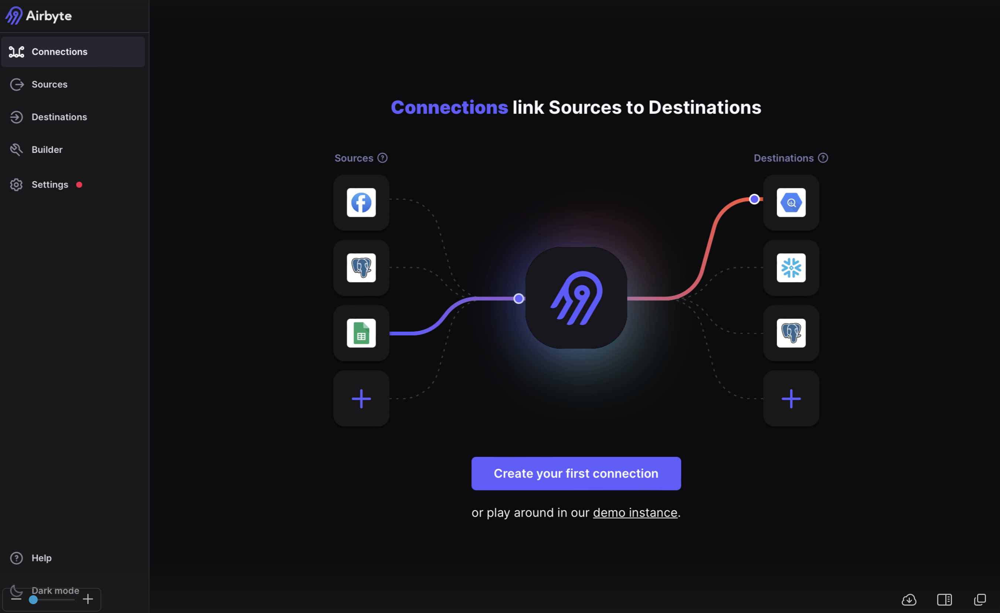


<b> Troubleshooting Tips: </b>


- If Airbyte isn't functioning properly, try to restart the Docker application manually and re-execute the command ./run-ab-platform.sh in terminal to startup airbyte.

- Review and adjust settings in the .env file and docker-compose.yml if needed, considering database connections, memory, and network, and port parameters.

- Remember to document any configuration changes you make for future reference and to ease troubleshooting.
<!-- ****** -->

<br> </br>

## [Building Your Airbyte to SQLite Connection](#building-your-airbyte-to-sqlite-connection)

To initiate the data extraction process, we need to define a connection in Airbyte. This will involve:

- Source Configuration: This is a low-code configuration file written in YAML syntax, specifying the details of the EPC endpoint, such as the API key and any required parameters for querying the data.

- Destination Configuration: In this case, the destination is your SQLite database file. You'll need to provide the necessary connection details, such as the file path.

<b> Source Configuration </b>

First, let's define the source from which Airbyte will extract data:

- Go to the Airbyte interface and select "Builder."

- Choose "Start from scratch" to begin configuring from a blank slate.

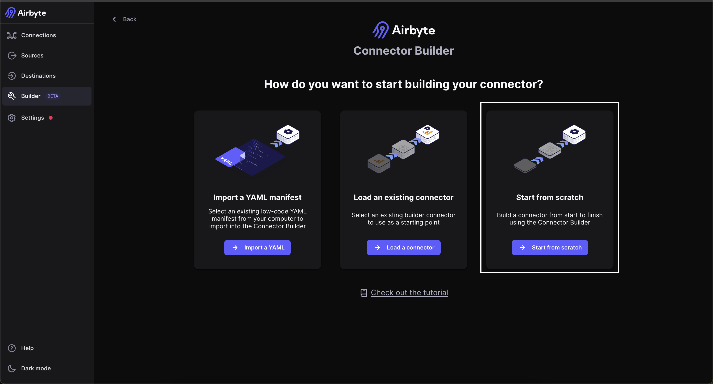

- In the configuration screen, input your YAML settings tailored to the EPC endpoint. This includes replacing placeholder tags such as <access-key> and <stream-name> with actual values. It's crucial to use correct indentation in your YAML file to prevent unexpected errors.

```yaml
spec:
  type: Spec
  connection_specification:
    type: object
    $schema: http://json-schema.org/draft-07/schema#
    required: []
    properties: {}
    additionalProperties: true
type: DeclarativeSource
check:
  type: CheckStream
  stream_names:
    - ==<stream-name>== #change <stream-name>
streams:
  - name: ==<stream-name>== #change <stream-name>
    type: DeclarativeStream
    retriever:
      type: SimpleRetriever
      paginator:
        type: DefaultPaginator
        page_size_option:
          type: RequestOption
          field_name: size
          inject_into: request_parameter
        page_token_option:
          type: RequestOption
          field_name: search-after
          inject_into: request_parameter
        pagination_strategy:
          type: CursorPagination
          page_size: 100
          cursor_value: '{{ headers[''X-Next-Search-After''] }}'
      requester:
        path: search
        type: HttpRequester
        url_base: https://epc.opendatacommunities.org/api/v1/domestic/
        http_method: GET
        authenticator:
          type: NoAuth
        request_headers:
          Accept: application/json
          Authorization:   <access-key>
        request_body_json: {}
        request_parameters: {}
      record_selector:
        type: RecordSelector
        extractor:
          type: DpathExtractor
          field_path:
            - rows
      partition_router:
        - type: ListPartitionRouter
          values:
            - E14000534
          cursor_field: constituency
          request_option:
            type: RequestOption
            field_name: constituency
            inject_into: request_parameter
    primary_key: []
    schema_loader:
      type: InlineSchemaLoader
      schema:
        type: object
        $schema: http://json-schema.org/schema#
        properties:
          uprn:
            type:
              - string
              - 'null'
          county:
            type:
              - string
              - 'null'
          tenure:
            type:
              - string
              - 'null'
          address:
            type:
              - string
              - 'null'
          lmk-key:
            type:
              - string
              - 'null'
          address1:
            type:
              - string
              - 'null'
          address2:
            type:
              - string
              - 'null'
          address3:
            type:
              - string
              - 'null'
          postcode:
            type:
              - string
              - 'null'
          posttown:
            type:
              - string
              - 'null'
          main-fuel:
            type:
              - string
              - 'null'
          built-form:
            type:
              - string
              - 'null'
          floor-level:
            type:
              - string
              - 'null'
          glazed-area:
            type:
              - string
              - 'null'
          glazed-type:
            type:
              - string
              - 'null'
          uprn-source:
            type:
              - string
              - 'null'
          constituency:
            type:
              - string
              - 'null'
          floor-height:
            type:
              - string
              - 'null'
          photo-supply:
            type:
              - string
              - 'null'
          roof-env-eff:
            type:
              - string
              - 'null'
          energy-tariff:
            type:
              - string
              - 'null'
          floor-env-eff:
            type:
              - string
              - 'null'
          property-type:
            type:
              - string
              - 'null'
          walls-env-eff:
            type:
              - string
              - 'null'
          lodgement-date:
            type:
              - string
              - 'null'
          mains-gas-flag:
            type:
              - string
              - 'null'
          extension-count:
            type:
              - string
              - 'null'
          flat-top-storey:
            type:
              - string
              - 'null'
          inspection-date:
            type:
              - string
              - 'null'
          local-authority:
            type:
              - string
              - 'null'
          roof-energy-eff:
            type:
              - string
              - 'null'
          windows-env-eff:
            type:
              - string
              - 'null'
          floor-energy-eff:
            type:
              - string
              - 'null'
          lighting-env-eff:
            type:
              - string
              - 'null'
          mainheat-env-eff:
            type:
              - string
              - 'null'
          roof-description:
            type:
              - string
              - 'null'
          sheating-env-eff:
            type:
              - string
              - 'null'
          total-floor-area:
            type:
              - string
              - 'null'
          transaction-type:
            type:
              - string
              - 'null'
          walls-energy-eff:
            type:
              - string
              - 'null'
          flat-storey-count:
            type:
              - string
              - 'null'
          floor-description:
            type:
              - string
              - 'null'
          hot-water-env-eff:
            type:
              - string
              - 'null'
          mainheatc-env-eff:
            type:
              - string
              - 'null'
          walls-description:
            type:
              - string
              - 'null'
          constituency-label:
            type:
              - string
              - 'null'
          heat-loss-corridor:
            type:
              - string
              - 'null'
          lodgement-datetime:
            type:
              - string
              - 'null'
          wind-turbine-count:
            type:
              - string
              - 'null'
          windows-energy-eff:
            type:
              - string
              - 'null'
          lighting-energy-eff:
            type:
              - string
              - 'null'
          low-energy-lighting:
            type:
              - string
              - 'null'
          mainheat-energy-eff:
            type:
              - string
              - 'null'
          number-heated-rooms:
            type:
              - string
              - 'null'
          sheating-energy-eff:
            type:
              - string
              - 'null'
          windows-description:
            type:
              - string
              - 'null'
          heating-cost-current:
            type:
              - string
              - 'null'
          hot-water-energy-eff:
            type:
              - string
              - 'null'
          hotwater-description:
            type:
              - string
              - 'null'
          lighting-description:
            type:
              - string
              - 'null'
          mainheat-description:
            type:
              - string
              - 'null'
          mainheatc-energy-eff:
            type:
              - string
              - 'null'
          co2-emissions-current:
            type:
              - string
              - 'null'
          construction-age-band:
            type:
              - string
              - 'null'
          current-energy-rating:
            type:
              - string
              - 'null'
          lighting-cost-current:
            type:
              - string
              - 'null'
          local-authority-label:
            type:
              - string
              - 'null'
          main-heating-controls:
            type:
              - string
              - 'null'
          heating-cost-potential:
            type:
              - string
              - 'null'
          hot-water-cost-current:
            type:
              - string
              - 'null'
          mechanical-ventilation:
            type:
              - string
              - 'null'
          multi-glaze-proportion:
            type:
              - string
              - 'null'
          number-habitable-rooms:
            type:
              - string
              - 'null'
          number-open-fireplaces:
            type:
              - string
              - 'null'
          secondheat-description:
            type:
              - string
              - 'null'
          co2-emissions-potential:
            type:
              - string
              - 'null'
          lighting-cost-potential:
            type:
              - string
              - 'null'
          potential-energy-rating:
            type:
              - string
              - 'null'
          hot-water-cost-potential:
            type:
              - string
              - 'null'
          mainheatcont-description:
            type:
              - string
              - 'null'
          solar-water-heating-flag:
            type:
              - string
              - 'null'
          unheated-corridor-length:
            type:
              - string
              - 'null'
          building-reference-number:
            type:
              - string
              - 'null'
          current-energy-efficiency:
            type:
              - string
              - 'null'
          energy-consumption-current:
            type:
              - string
              - 'null'
          environment-impact-current:
            type:
              - string
              - 'null'
          potential-energy-efficiency:
            type:
              - string
              - 'null'
          energy-consumption-potential:
            type:
              - string
              - 'null'
          environment-impact-potential:
            type:
              - string
              - 'null'
          fixed-lighting-outlets-count:
            type:
              - string
              - 'null'
          low-energy-fixed-light-count:
            type:
              - string
              - 'null'
          co2-emiss-curr-per-floor-area:
            type:
              - string
              - 'null'
version: 0.73.0
metadata:
  autoImportSchema:
   ==<stream-name>==: true #change <stream-name>
```
```
# Note: Airbyte's yaml configuration allows for flexible, structured requests to be sent to the EPC endpoint.

# More information on the structure of Airbyte's yaml configuration can be found [here](https://docs.airbyte.com/connector-development/config-based/understanding-the-yaml-file/yaml-overview)*
```

######  Understanding the Builder Panels to modify and test configurations
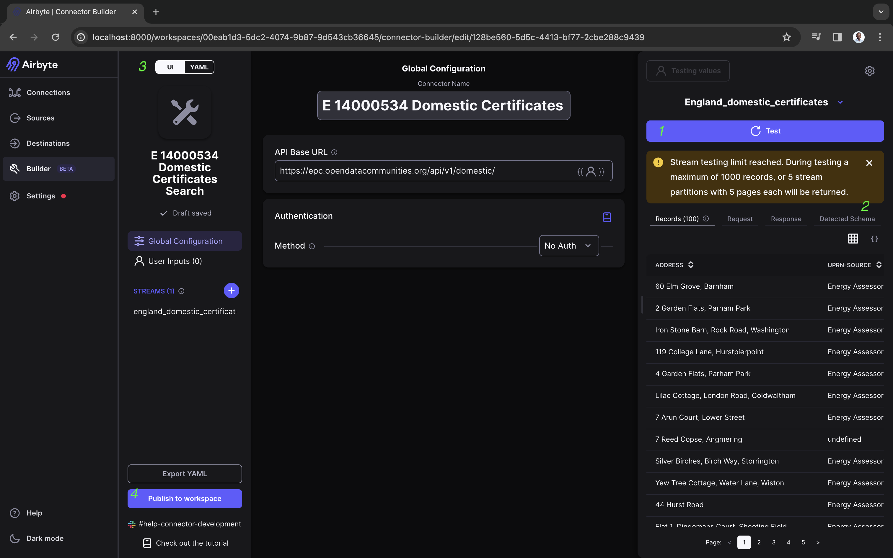
```markdown
Panel 1: Test: Here, we test our configuration. If the test passes, we're ready to move to the next step.

Panel 2: HTTP Requests and Responses: This panel gives insights into the requests we're making and structure responses we get back.

Panel 3: Configuration Modification: Choose between a YAML or UI view for making changes.

Panel 4: Publish to Workspace or Export: After finalizing our configurations, we either publish our source or export the YAML file.
```
- Now that you have your source configured, Add it as a custom source within Airbyte, as highlighted on the platform.

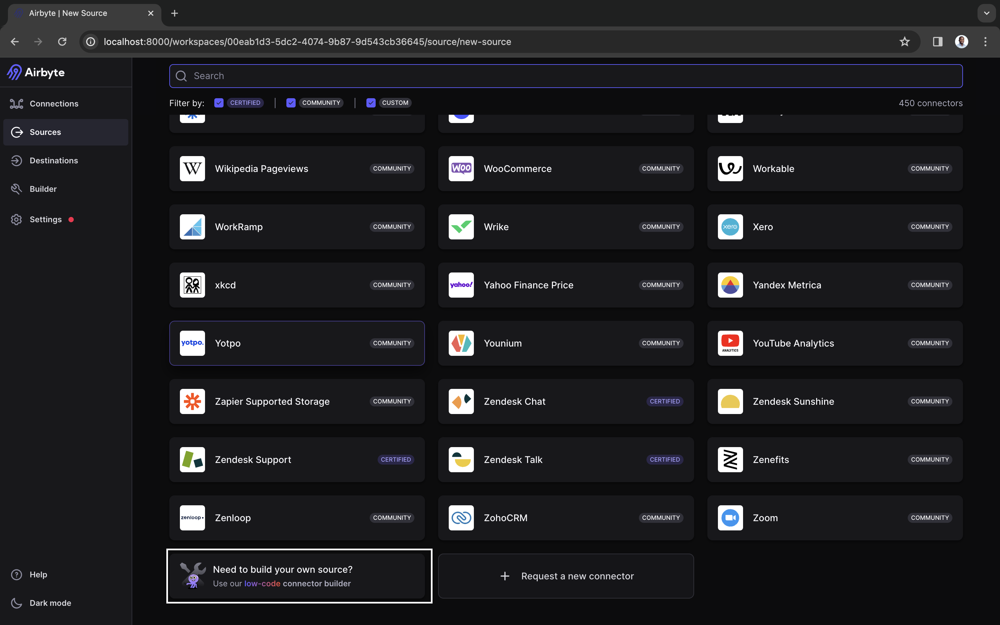

<b> Destination Configuration </b>


- Click on <b>Destination</b>, Search <b>“Local SQLite”.</b>

- Ensure the destination_path is starts with `/local`, and ends with name of your intended database file, in this case we chose `tutorial`, which makes our destination path `/local/tutorial`

- Click <b>Set up destination</b> after which a prompt should appear which confirms successful connection to database.

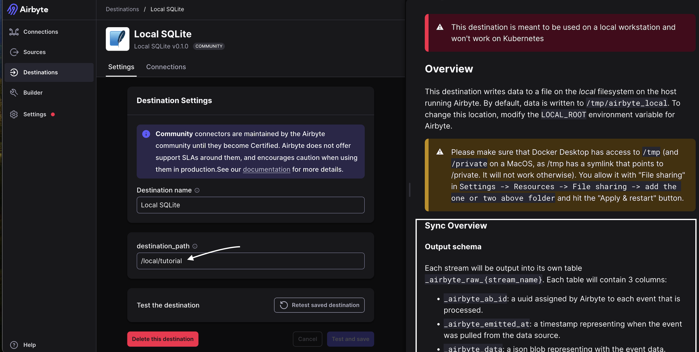

<b> Define and Run the Connection </b>

Once your custom source and destination are added :

- Create a new connection by selecting <b>"Connections"</b> and <b>"Set up a new source."</b>

- Locate your source by the name (default is `<stream-name>`) and set it up along with the SQLite destination you've defined.

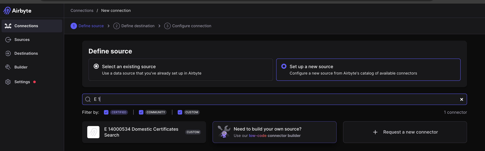

- Choose <b>Manual</b> as a schedule type and proceed to set up the connection.

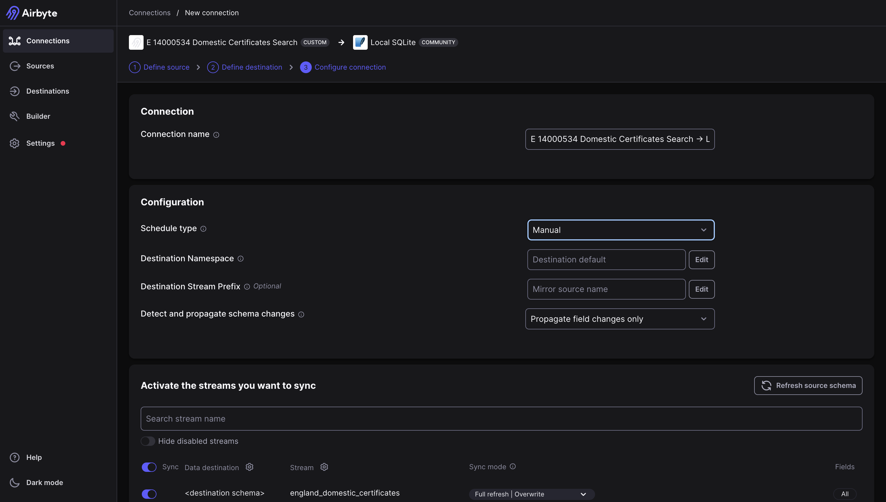
- Start data synchronization with <b>Sync now</b> and monitor the process via <b>Job History</b>
- From Job history, you can <b>view the logs</b>, which provide information on the running process.

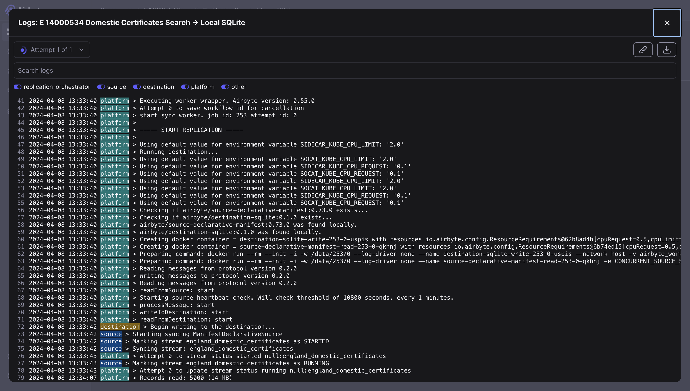

*Image below indicates successful data ingestion*
<br></br>

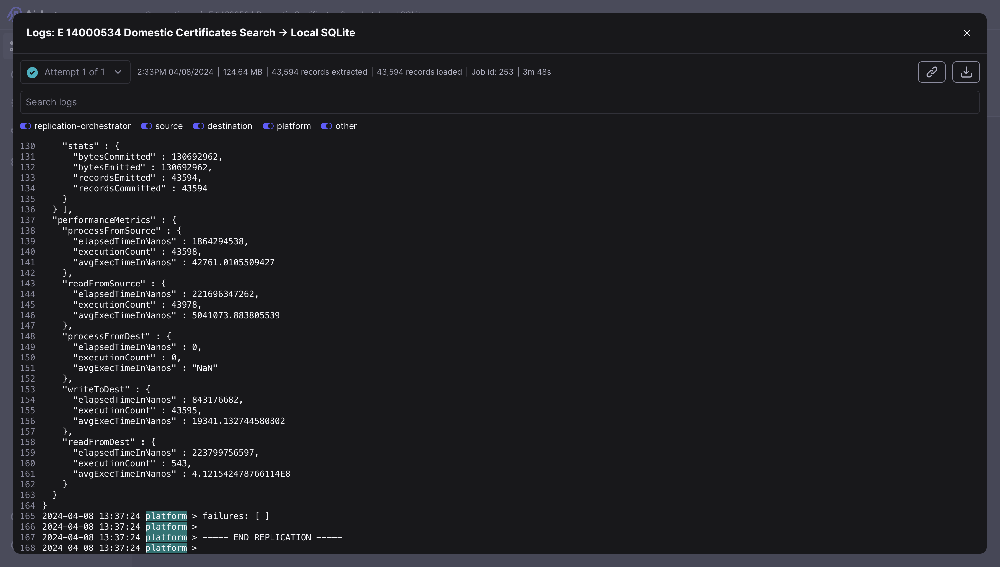

## [Retrieve Database file from Docker](#retrieve-database-file-from-docker)

Now that you have completed the data ingestion process, let's retrieve the database file from Docker:

- Run the below command to copy the database file from the container to your local directory.

```
cd <path/to/preferred directory>
```
```
docker cp airbyte-server:/tmp/airbyte_local/<database_filename> .
```
or
```
docker cp airbyte-server:/tmp/airbyte_local/<database_filename> <path/to/preferred directory>
```

- The data table will be named `_airbyte_raw_<table-name>` , while the schema will include Airbyte default columns, with the data of interest nested in the "airbyte_data" column.

<br></br>


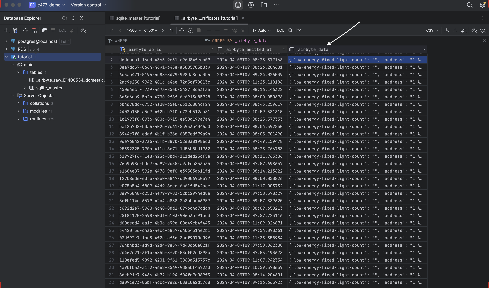

"You have built a connection from Airbyte to SQLite and successfully extracted the data

## [dbt Configuration with SQLite](#dbt-configuration-with-sqlite)

<!-- ### <u> Step 1: Dbt Setup</u> -->

We start by setting up a virtual environment within your IDE, providing an isolated space for our dbt project.


- We <b>install dbt-sqlite</b> using the command `pip install dbt-sqlite==1.4.0` or, with Poetry `poetry add dbt-sqlite@1.4.0`

- Next, we <b>install dbt-core</b> with the command ```pip install dbt-core==1.4.0 ```or with Poetry, ```poetry add dbt-core==1.4.0```.

- We must always ensure that the <b> versions of dbt-sqlite and dbt-core match</b> because they need to work in tandem eg: dbt-sqlite 1.4.0 is compatible with dbt-core 1.4.0.

- Now either create or modify existing profiles.yml file following the instructions provided [here](https://docs.getdbt.com/docs/core/connect-data-platform/sqlite-setup).

- Depending on your setup, we may need to install the <b>pytz</b> package manually. Do this by running ```pip install pytz``` or ```poetry add pytz```.

- Start a new dbt project called "dbt_tutorial,

```
dbt init <dbt_project_name>
```


- It is expected that you have modified your “project.yml file, usually present in “<root>/.dbt” directory with the code block below
``` yaml
<dbt_project_name>:
  target: dev
  outputs:
    dev:
      type: sqlite
      threads: 1
      database: "database" #do not change
      schema: 'main' #do not change
      schemas_and_paths:
        main: '<path-to-database-file>'
      schema_directory: '<path-to-database-directory>'
```


- Navigate to the new `<dbt_project_name>` directory in terminal with `cd <dbt_project_name>.` Inside this directory, you're now ready to define models, write SQL queries, and tailor your dbt project to your data needs.

- The output in the directory should look like dbt's template structure, showcasing various folders such as <b>models</b> and files like <b>dbt_project.yml</b>

- We’ll focus on the <b>models</b> folder. Remove the existing sample model SQL files and create a new file named <b>first_transformation.sql</b> for our custom SQL code.

```
 {{ config( materialized=’table’) }}

select
   json_extract(_airbyte_data,'$.address') as address,
   json_extract(_airbyte_data,'$.low-energy-fixed-light-count') as low_energy_fixed_light_count,
   json_extract(_airbyte_data,'$.uprn-source') as uprn_source,
   json_extract(_airbyte_data,'$.floor-height') as floor_height,
   json_extract(_airbyte_data,'$.heating-cost-potential') as heating_cost_potential,
   json_extract(_airbyte_data,'$.unheated-corridor-length') as unheated_corridor_length,
   json_extract(_airbyte_data,'$.hot-water-cost-potential') as hot_water_cost_potential,
   json_extract(_airbyte_data,'$.construction-age-band') as construction_age_band,
   json_extract(_airbyte_data,'$.potential-energy-rating') as potential_energy_rating,
   json_extract(_airbyte_data,'$.mainheat-energy-eff') as mainheat_energy_eff,
   json_extract(_airbyte_data,'$.windows-env-eff') as windows_env_eff,
   json_extract(_airbyte_data,'$.lighting-energy-eff') as lighting_energy_eff,
   json_extract(_airbyte_data,'$.environment-impact-potential') as environment_impact_potential,
   json_extract(_airbyte_data,'$.glazed-type') as glazed_type,
   json_extract(_airbyte_data,'$.heating-cost-current') as heating_cost_current,
   json_extract(_airbyte_data,'$.address3') as address3,
   json_extract(_airbyte_data,'$.mainheatcont-description') as mainheatcont_description,
   json_extract(_airbyte_data,'$.sheating-energy-eff') as sheating_energy_eff,
   json_extract(_airbyte_data,'$.property-type') as property_type,
   json_extract(_airbyte_data,'$.local-authority-label') as local_authority_label,
   json_extract(_airbyte_data,'$.fixed-lighting-outlets-count') as fixed_lighting_outlets_count,
   json_extract(_airbyte_data,'$.energy-tariff') as energy_tariff,
   json_extract(_airbyte_data,'$.mechanical-ventilation') as mechanical_ventilation,
   json_extract(_airbyte_data,'$.hot-water-cost-current') as hot_water_cost_current,
   json_extract(_airbyte_data,'$.county') as county,
   json_extract(_airbyte_data,'$.postcode') as postcode,
   json_extract(_airbyte_data,'$.solar-water-heating-flag') as solar_water_heating_flag,
   json_extract(_airbyte_data,'$.constituency') as constituency

from {{ source(‘main’, '<table-name>’) }}
```

- Additionally, create a <b>sources.yml</b> file within the <b>models</b> folder using the template provided.

```yaml
	version: 2
sources:
  - name: main
    tables:
      - name: <table-name> #change this
```

- Do not forget to replace `<table-name>` with `_airbyte_raw_<table_name>`

<br></br>

## [Running dbt Models with SQLite](#running-dbt-models-with-sqlite)

- To run your SQL queries, go back to the terminal, navigate to the dbt project directory, and execute dbt run.

```
cd <dbt_project_name>
```

```
dbt run
```

The output should look something like:
<br></br>
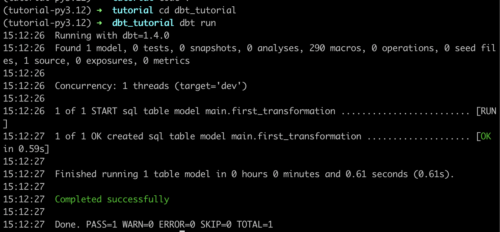

A <span style="color:green">“Completed successfully” </span> message in the terminal, signals a successful run of your dbt model.

<u>Troubleshooting</u>:

- If you face issues, it may be due to mismatched versions of dbt-sqlite and dbt-core or incorrect paths in your profiles.yml file.

- Ensure the "schemas_and_paths" and "schema_directory" both correctly direct to the database file and directory.

- Check this [link](https://docs.getdbt.com/docs/core/connect-data-platform/sqlite-setup) again for errors in configuration.


Pat yourself on the back, You have built a structured dbt project ready for running transformations on your SQLite database !</b>

<br></br>

## [Checking the SQLite Database](#checking-the-sqlite-database)

<b>Command-line</b>

Let’s verify the new table creation by dbt:

- We start the sqlite3 command-line tool in terminal.
```
sqlite3
```

- Open your existing database file

```
.open <path/to/existing/database/file>

```
- Check the existing tables

```
.tables
```

- You should see the newly created `first_transformation` table.

- View the first 10 rows with

```
Select * from first_transformation limit 10;
```

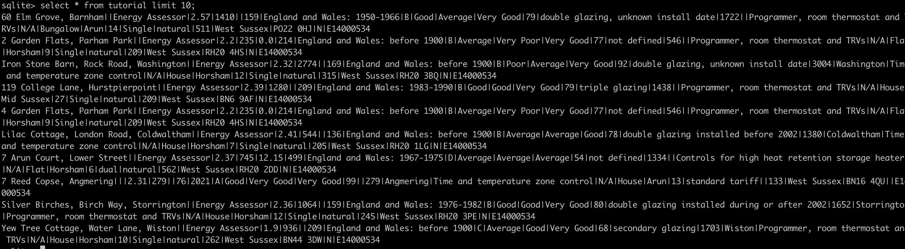

<b>DataGrip</b>

- For those who prefer a Graphical User Interface (GUI), you can download DataGrip from [here](  https://www.jetbrains.com/help/datagrip/installation-guide.html)

- After installation, set up a connection to your SQLite database file you transformed with Dbt.

- DataGrip's visual interface is intuitive and makes it easy to analyze the transformed data in the database.

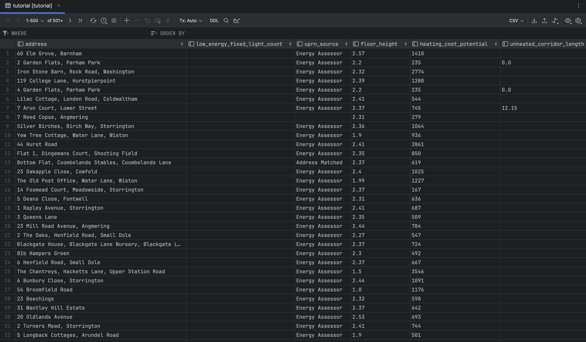

By completing these steps, you've successfully integrated dbt with SQLite and started manipulating data, ready for further analysis or integration into your workflows.
